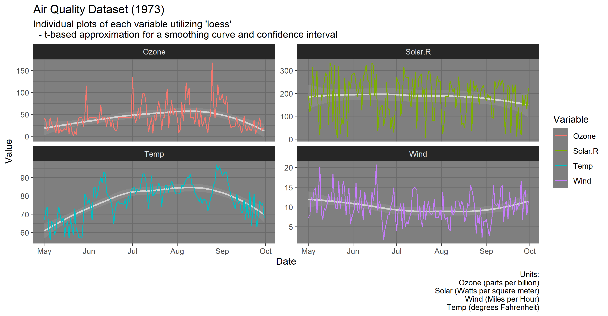

# Applied Data Science in R
### Projects completed as part of the Applied Data Science in R course at Syracuse University




#### R code to produce the graph

```R
ggplot(dfAQ_long, 
       aes(x = Date,
           y = Value,
           linetype = Variable,
           color = Variable)) +
  geom_smooth(method = "loess", linetype = 1, color = "lightgray") +
  geom_line(linetype = 1) +
  facet_wrap(~Variable, scales="free_y", nrow=2, strip.position="top") +
  theme_dark() +
  labs(name = "Variable",
       title = "Air Quality Dataset (1973)",
       subtitle = "Individual plots of each variable utilizing 'loess'
  - t-based approximation for a smoothing curve and confidence interval",
       caption = "Units:
       Ozone (parts per billion)
       Solar (Watts per square meter)
       Wind (Miles per Hour)
       Temp (degrees Fahrenheit)",
       ylab = "Values*")
```
